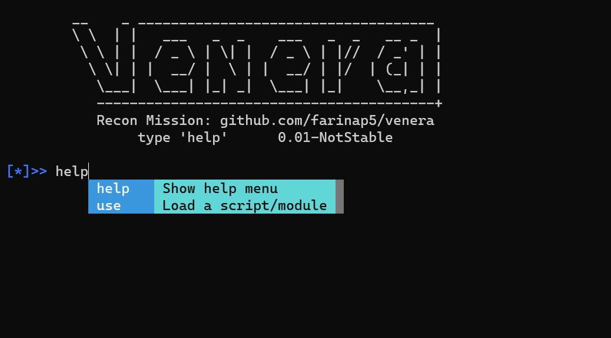
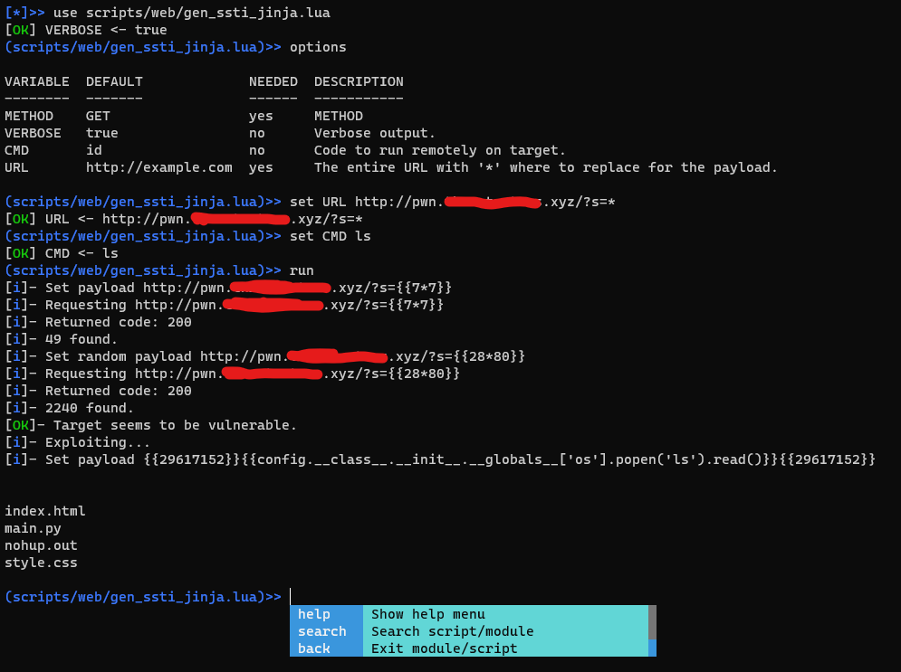

<h1 align="center">Venera Framework</h1>

Venera is a tool for automating customized tests and attacks agaist many kinds of protocol. It relies on a scripting engine based on the Lua scripting language that makes it possible to create modules for all types of checks and exploits. The framework is a manager and interpreter of lua scripts that provides functions and libraries for the creation of powerful tools integrated with services used during unitary tests, vulnerability scanning and exploitation fase. The user can create its own modules or use community made scripts, the tool is switchable for all kinds of need situation.

See the docs [venera.farinap5.com](https://venera.farinap5.com/)


---

### Download and Run

No binary files are included, have go environment installed.

```bash
make install-go-apt
```

```bash
git clone git@github.com:farinap5/Venera.git
cd  Venera
make run
```

### Help Menu
```
GENERIC COMMAND  DESCRIPTION
---------------  -----------
help             Show help menu. Type `help <cmd>`.
bash             Spawns a shell
import           Import a (edited) script
export           Export a script (to edit)
globals          Show global variables
vpm              Venera package manager
exit             Exits the prompt
search           Searches a script
use              Load a script

SCRIPT COMMAND  DESCRIPTION
--------------  -----------
set             Set value for a variable
run             Run a script/module
back            Exit module/script
options         Show variables of script/module
lua             Run Lua code in running script
info            Info/metadata about script/module
reload          Reloads the current script/module
```

Use help command to describe each command with examples.

```
[vnr]>> help search

SEARCHING:
    `search` list scripts.
    `search match <key>` list matching patterns.
    `search match:path <key>` list path matching.
    `search match:description <key>` list description matching.
    `search tag <tag1 tag2...>` list matching tags.
```

A simple example of the interface:



---

## How does a module work? 

The module is a lua script created with one or many goals, the module will execute a routine of your choice as you would code it as you want.

The modules done allow testers to target a specific, known vulnerability, or to perform generic verifications against the remote/local target.

**See some examples in:** https://github.com/farinap5/Venera/tree/main/scripts/test.

The module has some essential tables as `METADATA` and `VARS` being loaded from `Init()`, and then the `Main()` function with the entrypoint of custom functions.

### Table `METADATA`

`METADATA` takes information reguarding the script so Venera can identify this module in its script base, all fields need to be configured properly.
- `AUTHOR` is a list of strings, others who created the script or have participated in research for that flaw it abuses as example.
- `VERSION` module/script version.
- `TAGS` Some tags that define the script and its purpose. Scripts can be searched and executed based on their tags.
- `INFO` The description of the script can, fault that abuses, type of test, proposed mitigations, it's up to the creator.

```lua
METADATA = {
    AUTHOR = {"Author1 <author1@mail.com>"},
    VERSION = "0.1",
    TAGS = {"example","http","scanner"},
    INFO = [[HTTP requests with lua-go]]
}
```
### Table `VARS`

`VARS` table loads the script's variables, which it uses as parameters for its actions.

```lua
VARS = {
    URL = {VALUE="http://example.com", NEEDED="yes", DESCRIPT="URL"},
    METHOD = {VALUE="GET", NEEDED="yes", DESCRIPT="METHOD"}
}
```

When the variables are setted in `VARS` table, the user is able to interact with them using the command `options` to list those variables, and then the command `set` to configure a value for a variable:

```
(scripts/test/http.lua)>> options

VARIABLE  DEFAULT             NEEDED  DESCRIPTION
--------  -------             ------  -----------
URL       http://example.com  yes     URL
METHOD    GET                 yes     METHOD
```

As mentioned, user also can edit those variables with the `set` command:

```
(scripts/test/http.lua)>> set URL http://google.com
[OK] URL <- http://google.com
```

### Function `Init()`

When you run `use <script.lua>` the `Init()` function is automatically executed, so the metadata and variables are loaded. You can put other things in the function to load on the first iteraction.

```lua
function Init()
    Meta(METADATA) -- Load metadata 
    LoadVars(VARS) -- Load variables
end
```

### Function `Main()`

The function `Main()` is the entrypoint of your custom script. It is called when user types `run`.

```lua
function Main()
    local request = http.request(VARS.METHOD.VALUE, VARS.URL.VALUE)
    local result, err = client:do_request(request)
    PrintSuccsln(result.code)
    PrintSuccsln(result.body)
end
```

## Built-in Functions

You can call those function within the script without requirements. Those functions are written in golang and can be called from the lua script.

`PrintSuccs( str )` Print success message.

`PrintErr( str )` Print error message.

`PrintInfo( str )` Print info message.

`PrintSuccsln( str )`  Print success message with line ending.

`PrintErrln( str )` Print error message with line ending.

`PrintInfoln( str )` Print info message with line ending.

`Print( str )` Print string.

`Println( str )` Print string with line ending.

`RandomString( length=int , "a-zA-Z0-9" ) -> str` Generates random string.

`Input( str ) ->  str` Prompt for an user input.

`Open( str ) -> str` Read a local file.

`Call( path=str )` Call another script/module. The `ARGS` from caller scripts are inherited by scripts being called. 
